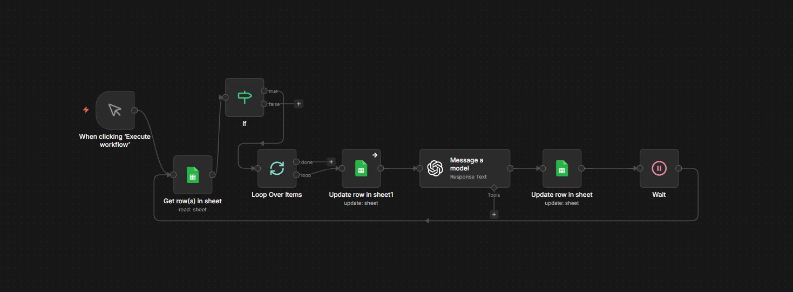

# AI Lead Enrichment and Qualification System

An AI-powered n8n workflow that reviews lead records, generates factual business descriptions, scores lead quality, and classifies each lead as HOT, WARM, or COLD.

## Project Overview

This automation helps businesses review lead lists more efficiently and identify which prospects are worth contacting.

The workflow reads lead information from Google Sheets, processes each eligible record with OpenAI, and writes the qualification results back to the same spreadsheet.

## Business Problem

Businesses often collect lead information without having a clear way to evaluate its completeness or quality.

Manually reviewing every lead can be repetitive and time-consuming, especially when the list contains incomplete or inconsistent information.

## Solution

This system automatically:

- Reads lead records from Google Sheets
- Skips leads that have already been processed successfully
- Marks each active lead as processing
- Generates a factual business description using the available information
- Assigns a qualification score from 1 to 10
- Classifies the lead as HOT, WARM, or COLD
- Updates the original Google Sheet with the results
- Marks completed records as successful

## Key Features

- Automated lead-list review
- AI-generated business descriptions
- Lead scoring from 1–10
- HOT, WARM, and COLD classification
- Google Sheets record updates
- Duplicate-processing prevention
- Processing-status tracking
- Controlled delay between workflow cycles
- Structured OpenAI JSON output

## Tools and Technologies

| Tool | Purpose |
|---|---|
| n8n | Workflow orchestration and automation |
| OpenAI | Lead analysis, description generation, scoring, and classification |
| Google Sheets | Lead storage, input, and result tracking |
| JSON | Workflow export and structured AI response format |

## System Architecture

```text
Manual Trigger
      ↓
Read Leads from Google Sheets
      ↓
Check Processing Status
      ↓
Loop Through Eligible Leads
      ↓
Mark Lead as Processing
      ↓
OpenAI Analysis
      ↓
Generate Description, Score, and Status
      ↓
Update Google Sheets
      ↓
Mark Lead as Successful
      ↓
Wait and Continue

```

## Workflow Screenshot


